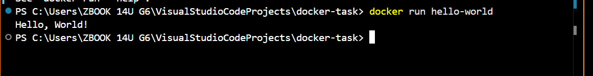
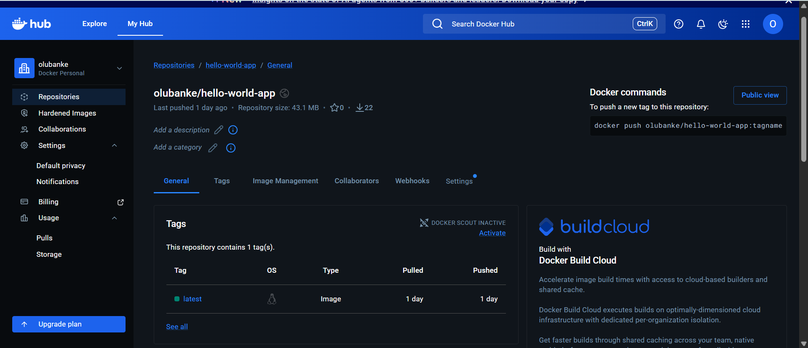
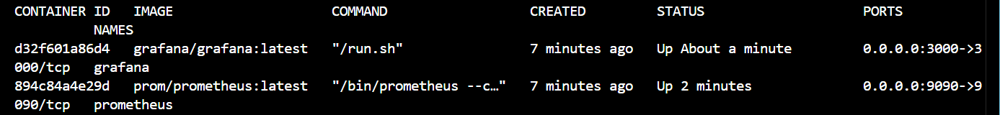

# Hello World Docker Task

A lightweight Python application containerized with Docker.

---

## Quick Start

Follow these steps to build and run the application in a containerized environment.

### 1. Prerequisites

Ensure you have [Docker](https://docs.docker.com/get-docker/) installed and running on your system.

### 2. Build the Image

The following command packages the Python script and the required environment into a Docker image.

```bash
docker build -t hello-world .
```

### 3. Run the Container

Execute the image as a container to see the output.

```bash
docker run hello-world
```



---

## Steps Taken to Complete This Task

### 1. Project Setup

- Created a new directory for the Docker project
- Initialized a Python application with an `app.py` file

### 2. Containerization

- Created a `Dockerfile` with Python 3.9 slim base image
- Configured the working directory and copied application files
- Exposed port 3000 for the application
- Set the command to run `python app.py`

### 3. Local Testing

- Built the Docker image using `docker build -t hello-world .`
- Tested the container locally with `docker run hello-world`
- Verified the application runs correctly in the containerized environment

### 4. CI/CD Pipeline

- Created GitHub Actions workflow (`.github/workflows/github-actions-demo.yml`)
- Configured automated build and push to Docker Hub on push to main branch
- Set up Docker Hub authentication using GitHub secrets
- Verified the CI/CD pipeline successfully builds and pushes the image to Docker Hub


Docker Hub Repository: [https://hub.docker.com/r/olubanke/hello-world-app](https://hub.docker.com/r/olubanke/hello-world-app)

## Running Containers

This Docker Compose setup includes the following services:

- **Grafana** (Port 3000)
- **Prometheus** (Port 9090)
- **Blackbox Exporter** (Port 9115) 


### Service Details

| Service | Port | Purpose |
|---------|------|---------|
| Grafana | 3000 | Web UI for visualizing Prometheus metrics |
| Prometheus | 9090 | Time-series database for storing metrics |
| Blackbox Exporter | 9115 | Probing endpoints over HTTP, HTTPS, DNS, TCP, ICMP |

### Starting Services
```bash
docker-compose up -d